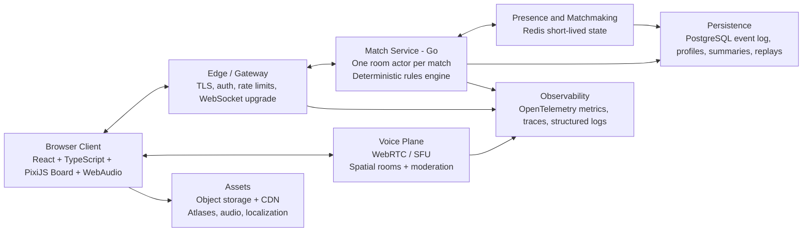
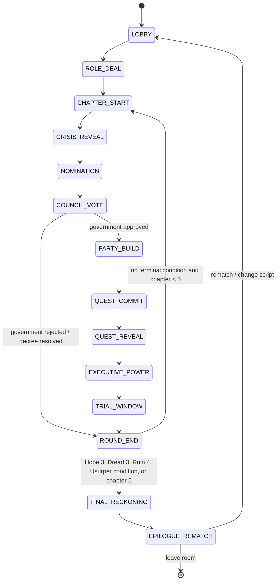

# Crownfall

## A 40-Minute Fantasy Social Deduction RPG

**Complete Product and Game Design Document**  
**Version 1.0 | Original Concept | July 2026**

## Agent Consumption Notes

- This file is the canonical text representation of the Crownfall GDD/PDD.
- Headings are semantic and ordered; role headings use stable `role-*` anchors and scenario headings use stable `scenario-*` anchors.
- Uppercase state names such as `LOBBY`, `QUEST_COMMIT`, and `FINAL_RECKONING` are normative engine identifiers.
- Tables contain normative balance values, content matrices, and acceptance criteria.
- Mermaid and text diagrams replace visual-only figures so the document remains self-contained and machine-readable.
- Rules use **must**, **cannot**, and **exactly** normatively. Descriptive fiction and examples are non-normative unless a section states otherwise.

**CONFIDENTIAL DESIGN BIBLE - ORIGINAL IP**

This document defines an original game system. It studies established social-deduction design patterns but does not copy any protected art, names, text, characters, or scenario content.

# Document Control

| **Field**                 | **Value**                                                                   |
|---------------------------|-----------------------------------------------------------------------------|
| Product                   | Crownfall                                                                   |
| Document                  | Complete Product and Game Design Document (GDD/PDD)                         |
| Version                   | 1.0 - Pre-production design baseline                                        |
| Date                      | July 2026                                                                   |
| Primary platform          | Web browser, desktop-first with responsive tablet support                   |
| Session promise           | 6-10 players; 35-45 minutes; online voice-first party play                  |
| Business model assumption | Premium base game or host-owned room license; cosmetics only; no pay-to-win |
| Status                    | Ready for paper prototype, rules-engine spike, and structured playtesting   |

> **Design Thesis:** Crownfall compresses the emotional arc of a tabletop fantasy campaign into one replayable forty-minute session: a crisis, a fragile government, dangerous quests, uncertain information, public accusations, and a final ending authored by the players.

## Research and Design Basis

The design uses original mechanics while learning from proven patterns. Secret Hitler demonstrates the tension created by public government votes, private information, escalating powers, and a hidden leader win condition [R1]. Blood on the Clocktower demonstrates how role scripts, controlled misinformation, and continued participation after death can prevent early elimination from becoming boredom [R2]. The system also treats the game as an imperfect-information domain; simulation and information-set analysis are therefore useful before and alongside human playtesting [R3].

For the online implementation, the architecture uses an authoritative server over bidirectional WebSocket messaging [T1], browser-native WebRTC voice [T2], GPU-accelerated 2D rendering through PixiJS or an equivalent renderer [T3], and production observability/load-testing practices [T4-T5].

## Contents

- 1. Product Vision and Audience

- 2. World, Tone, and Narrative Grammar

- 3. Complete Rules and Match Structure

- 4. Components, Tracks, and Information Model

- 5. Role Architecture and Complete Role Compendium

- 6. Scenario Bible: Eight Complete Scripts

- 7. Event, Quest, and Ending Systems

- 8. Win Conditions and Outcome Matrix

- 9. Probability, Balance, and Playtest Model

- 10. UI/UX Specification and Wireframes

- 11. Technical Architecture and Data Contracts

- 12. Security, Fairness, Performance, and Operations

- 13. Production Roadmap and Acceptance Criteria

- Appendices: Quick Rules, Glossary, References

# 1. Product Vision and Audience

The experience promise, scope, and product constraints.

## 1.1 One-Sentence Pitch

> **Pitch:** A voice-first fantasy social-deduction game where a rotating Regent forms governments, selects adventuring parties, and tries to save a kingdom while a hidden cabal manipulates every quest - all in a complete 35-45 minute story.

## 1.2 Player Fantasy

- “I convinced everyone to trust the wrong hero, then watched the kingdom crown me.”

- “We failed two quests, found a contradiction in the vote history, and exposed the Usurper in the final minute.”

- “My personal oath forced me to protect a player I suspected, and that choice created the ending.”

- “The match ended like a chapter of a fantasy novel, and the rematch told a completely different story.”

## 1.3 Product Pillars

| **Pillar**                            | **Design Requirement**                                                             | **Failure to Avoid**                                 |
|---------------------------------------|------------------------------------------------------------------------------------|------------------------------------------------------|
| Social pressure                       | Every chapter creates a reason to talk, accuse, defend, bargain, or reveal.        | Silent optimization or UI-only play.                 |
| Incomplete but actionable information | Clues narrow possibilities but rarely solve a player outright.                     | Binary scans that remove deduction.                  |
| A complete dramatic arc               | Every match reaches a named ending and creates a readable Chronicle.               | Abrupt score-screen endings.                         |
| No dead-player boredom                | Banished players become Fallen: reduced agency, continued voice, one Last Vote.    | Twenty minutes of spectating after an early mistake. |
| Replayable scripts                    | Roles, events, quests, Moon Laws, and personal oaths recombine.                    | A solved “best route” after ten matches.             |
| Server-enforced fairness              | Hidden information is sent only to eligible recipients; every action is validated. | Client-authoritative state or accidental role leaks. |

## 1.4 Target Audience

Primary: groups of 6-10 friends who enjoy Mafia, Avalon, Secret Hitler, tabletop RPGs, bluffing, and live voice conversation, but cannot commit to multi-hour campaigns. Secondary: streamers, university groups, remote teams, and board-game communities seeking a hostless online experience.

## 1.5 Product Boundaries

- No persistent power progression. Profile progression is cosmetic and statistical only.

- No open-world MMO, grind, loot rarity economy, or collectible card monetization.

- No mandatory game master; the server is the impartial Storyteller.

- No unrestricted private text during a match. Private communication is structured to reduce harassment and collusion outside intended mechanics.

- No direct use of real-world extremist themes, iconography, or historical political factions.

# 2. World, Tone, and Narrative Grammar

## 2.1 The Realm of Valoria

Valoria is a story engine rather than a fixed campaign map. It is a late-medieval fantasy realm built around three institutions: the Crown, which promises continuity; the Veiled Court, which believes crisis justifies secret rule; and the Wanderers, who pursue vows that do not fit either faction. Each scenario zooms into one decisive night: a succession, dragon bargain, plague, wedding, expedition, siege, religious crisis, or cosmic fracture.

## 2.2 Tone

| **Dimension** | **Target**                                                                  |
|---------------|-----------------------------------------------------------------------------|
| Fantasy       | Grounded high fantasy: heraldry, relics, curses, dragons, and court ritual. |
| Emotion       | Suspicion, triumph, dread, dark humor, and sudden reversals.                |
| Violence      | Stylized and implied. No gore dependency.                                   |
| Humor         | Character-driven table humor, not meme spam in the core fiction.            |
| Accessibility | Readable iconography and plain-language rules beneath the fantasy surface.  |

## 2.3 Narrative Grammar

Every match follows the same dramatic grammar: an impossible crisis creates urgency; office grants temporary authority; authority chooses who faces danger; secret action creates an uncertain outcome; outcome produces evidence and consequences; accusation redistributes trust; the final Chronicle explains how the table authored the ending.


Figure 1 - The chapter loop used by every scenario.

## 2.4 The Chronicle

The Chronicle is a deterministic narrative summary generated from the event log. It records governments, votes, party membership, public claims, Quest results, trials, role reveals, and the final ending. It is not an AI-written feature. Sentences are assembled from authored templates so replays remain factual, localizable, and safe.

# 3. Complete Rules and Match Structure

## 3.1 Player Count, Duration, and Recommended Setup

| **Players** | **Crown** | **Shadow** | **Wanderer** | **Recommended experience** |
|-------------|-----------|------------|--------------|----------------------------|
| 6           | 4         | 2          | 0            | Introductory               |
| 7           | 4         | 2          | 1            | Standard                   |
| 8           | 5         | 2          | 1            | Standard                   |
| 9           | 5         | 3          | 1            | Advanced                   |
| 10          | 6         | 3          | 1            | Advanced                   |

Every Shadow setup includes the Usurper. At 6-7 players, all Shadow players know one another. At 8-10 players, Shadow agents know the Usurper and each other, but the Usurper receives only a count of allied signals, not identities. Wanderers never count as Crown or Shadow for alignment checks unless their card explicitly says otherwise.

## 3.2 Match Clock

| **Stage**                               | **Target duration** | **Hard cap**      | **Purpose**                                   |
|-----------------------------------------|---------------------|-------------------|-----------------------------------------------|
| Lobby and voice check                   | 2-4 min             | Host controlled   | Seat players, select script, test audio.      |
| Role reveal and first-night information | 2 min               | 150 sec           | Teach private identity and opening knowledge. |
| Each chapter                            | 5-7 min             | 8 min             | Government, Quest, evidence, optional Trial.  |
| Maximum chapters                        | 5                   | -                | Best-of-five Quest structure.                 |
| Final Reckoning and reveal              | 3-5 min             | 6 min             | Resolve scenario ending and personal oaths.   |
| Total                                   | 35-45 min           | 50 min safety cap | Rematch-friendly party session.               |

## 3.3 Offices

The Regent rotates clockwise each chapter. The Regent nominates one eligible Pathfinder. The Pathfinder leads party selection and resolves scenario choices. The last successfully elected Regent and Pathfinder are ineligible to become Pathfinder in the next chapter; with five living players, only the last Pathfinder is ineligible. Banished players cannot hold office.

## 3.4 Government Vote

1.  The Regent nominates an eligible Pathfinder.

2.  The table receives a timed debate window. The Regent may change the nomination once before locking.

3.  Every living player and every Fallen player with an unused Last Vote chooses Approve or Reject.

4.  Votes reveal simultaneously. Strict majority Approve elects the government; ties reject.

5.  A rejection advances Fracture by one. At Fracture 3, resolve a Mob Decree, add one Ruin, clear term limits, reset Fracture, and advance the chapter without a normal government.

## 3.5 Party Selection and Quest Sigils

The elected government selects the number of party members listed for the current chapter. The Regent must be eligible to join but is not automatically included. Selected players secretly commit one allowed Sigil: Aid, Betray, or a role-specific action. Crown roles normally possess Aid only; Shadow roles possess Aid and Betray; Wanderers follow their card. Sigils are shuffled server-side and revealed without owners.

| **Players** | **Quest I** | **Quest II** | **Quest III** | **Quest IV** | **Quest V** |
|-------------|-------------|--------------|---------------|--------------|-------------|
| 6           | 2           | 3            | 3             | 4            | 4           |
| 7           | 2           | 3            | 3             | 4            | 4           |
| 8           | 3           | 4            | 4             | 5            | 5           |
| 9           | 3           | 4            | 4             | 5            | 5           |
| 10          | 3           | 4            | 4             | 5            | 5           |

A Quest normally fails with at least one Betray. Quest IV requires two Betrays to fail, making it a high-trust chapter and preventing a single hidden enemy from deciding every match. Scenario and role effects may modify thresholds, but the UI always displays the effective rule before commitment.

## 3.6 Progress Tracks

| **Track** | **Range** | **Meaning**                                                                          | **Terminal condition**                                                                        |
|-----------|-----------|--------------------------------------------------------------------------------------|-----------------------------------------------------------------------------------------------|
| Hope      | 0-3       | Successful Quests and constructive story choices.                                    | At 3, Crown reaches a provisional victory and proceeds to the scenario ending check.          |
| Dread     | 0-3       | Failed Quests and successful Shadow escalations.                                     | At 3, Shadow reaches a provisional victory and proceeds to the scenario ending check.         |
| Ruin      | 0-4       | Institutional collapse caused by deadlock, reckless choices, and scenario disasters. | At 4, the catastrophe ending overrides ordinary faction victory unless a card says otherwise. |
| Fracture  | 0-3       | Consecutive failed governments.                                                      | At 3, Mob Decree and +1 Ruin; then reset.                                                     |

## 3.7 The Usurper Condition

> **Immediate Shadow Victory:** After Dread reaches 2, if an elected Pathfinder is the Usurper, the match ends immediately in the scenario’s Shadow ending. The Usurper must confirm truthfully to the server; the server already knows the role and performs the reveal automatically.

## 3.8 Trial and Banishment

After Quest resolution, the chapter may open one Trial. Any living player with at least one Evidence may nominate. Each player can be nominated once per match unless an event resets eligibility. Strict majority Banished removes office eligibility, party eligibility, and active abilities. The player becomes Fallen: they may continue voice discussion, retain private knowledge, and hold one Last Vote usable in any future Council or Trial. This preserves participation while making Banishment strategically meaningful.

## 3.9 Final Reckoning

The match enters Final Reckoning immediately at Hope 3, Dread 3, Ruin 4, the Usurper condition, or after Chapter 5. The server evaluates ending conditions in this order: catastrophe override; scenario singular ending; faction ending; personal Wanderer oath; tie-break ending. The epilogue reveals all roles, objectives, private states, and the complete Chronicle.

## 3.10 Information Rules

- Players may lie about any private information, role, faction, objective, whisper, Sigil, or ability result.

- The server never asks a player to lie about a game-ending reveal.

- Screenshots and external communication are prohibited in ranked rooms; friendly rooms may self-police.

- Private role messages use fixed templates or server-authored content.

- The public script lists possible roles, not roles confirmed to be in play.

# 4. Components, Tracks, and Information Model

## 4.1 Digital Components

| **Component**    | **Count / behavior**                                                                          |
|------------------|-----------------------------------------------------------------------------------------------|
| Role cards       | 28 core roles; scenario scripts expose 14-18 possible roles.                                  |
| Scenario boards  | 8, each with unique resources, five Quests, eight Crisis events, and four endings.            |
| Sigils           | Aid, Betray, and role-specific action tokens.                                                 |
| Evidence         | Public tokens earned through contradictions, roles, and scenario choices.                     |
| States           | Protected, Marked, Poisoned, Cursed, Silenced, Suspect, Fallen, Infected.                     |
| Chronicle events | Append-only server events used for replay and epilogue.                                       |
| Voice rooms      | One public council room; optional structured private pairing only when a scenario enables it. |

## 4.2 Public, Private, and Derived State

| **Visibility**        | **Examples**                                                                                  | **Server rule**                                                            |
|-----------------------|-----------------------------------------------------------------------------------------------|----------------------------------------------------------------------------|
| Public                | Seats, offices, votes after reveal, tracks, party list, Quest result, Evidence, Fallen state. | Broadcast to every connected client and replay viewer.                     |
| Private to one player | Role, faction, objective, condition, investigation result, forged whisper.                    | Send only through the player-specific projection.                          |
| Private to a faction  | Shadow recognition, limited faction chat during setup.                                        | Never included in public snapshots or spectator payloads.                  |
| Derived / server only | RNG seed, unrevealed event order, role mapping, pending delayed effects.                      | Stored encrypted at rest for active matches and redacted from client logs. |

## 4.3 Evidence

Evidence is not proof of alignment. It is a public currency for procedural power: nominating a Trial, challenging forged evidence, requesting a vote audit, or unlocking scenario options. Evidence is earned by participating in successful risky Quests, exposing contradictions through defined mechanics, and accepting certain costs. This turns “I noticed something” into a limited game action without replacing conversation.

# 5. Role Architecture and Complete Role Compendium

## 5.1 Role Budget Model

Roles are rated from 0-5 across Information, Influence, Defense, Disruption, and Exposure Risk. Crown roles target an average active impact budget of 5.0; Shadow roles target 6.0 because they are an informed minority but carry higher exposure risk; Wanderers target 4.5 plus a difficult objective. These ratings are balancing instruments, not player-visible power levels.

| **Faction** | **Role count** | **Design job**                                                                             | **Average win target**                     |
|-------------|----------------|--------------------------------------------------------------------------------------------|--------------------------------------------|
| Crown       | 14             | Generate partial truth, protect fragile processes, and coordinate the uninformed majority. | 47-53% team win.                           |
| Shadow      | 8              | Create plausible misinformation, manipulate institutions, and protect the Usurper.         | 47-53% team win.                           |
| Wanderer    | 6              | Distort incentives without replacing the central Crown/Shadow conflict.                    | 15-30% personal success depending on role. |

<a id="role-01-oathbound-knight"></a>

### 1. Oathbound Knight

| **Faction** | **Complexity** | **Information** | **Influence** | **Defense** | **Disruption** | **Exposure** |
|-------------|----------------|-----------------|---------------|-------------|----------------|--------------|
| Crown       | 2/5            | 0/5             | 2/5           | 5/5         | 1/5            | 2/5          |

**Ability:** Once per match, place Guard on another player before a Quest reveal. If that player would be Banished or killed by a role effect this chapter, cancel it and publicly reveal the Guard.

**Limits:** Cannot target self; expires at chapter end; does not prevent scenario catastrophe.

**Counterplay:** Force the Knight to commit early, bait the Guard, or pressure the Knight into protecting a suspicious player.

**Design purpose:** A low-information anchor that creates visible loyalty tests and protects important investigators.

<a id="role-02-oracle-of-glass"></a>

### 2. Oracle of Glass

| **Faction** | **Complexity** | **Information** | **Influence** | **Defense** | **Disruption** | **Exposure** |
|-------------|----------------|-----------------|---------------|-------------|----------------|--------------|
| Crown       | 3/5            | 5/5             | 1/5           | 0/5         | 0/5            | 3/5          |

**Ability:** At the start of Chapters 2 and 4, privately learn whether at least one of two selected players belongs to Shadow. The result is about the pair, never an individual.

**Limits:** Two uses; cannot select the same pair twice; poisoned or cursed states can invert one result.

**Counterplay:** Shadow can pair a known innocent with an ally, challenge timing claims, or impersonate the Oracle.

**Design purpose:** High-value but ambiguous information that fuels discussion instead of solving the table.

<a id="role-03-royal-inquisitor"></a>

### 3. Royal Inquisitor

| **Faction** | **Complexity** | **Information** | **Influence** | **Defense** | **Disruption** | **Exposure** |
|-------------|----------------|-----------------|---------------|-------------|----------------|--------------|
| Crown       | 3/5            | 4/5             | 3/5           | 1/5         | 1/5            | 4/5          |

**Ability:** After a failed Quest, inspect one committed Sigil and learn whether it was Aid, Betray, or altered by an ability. The owner is not revealed.

**Limits:** Once per match; must be used immediately after a failed Quest.

**Counterplay:** Multiple Shadow members can coordinate, while role-altered Sigils create plausible deniability.

**Design purpose:** Creates forensic evidence without exposing a player directly.

<a id="role-04-dawn-cleric"></a>

### 4. Dawn Cleric

| **Faction** | **Complexity** | **Information** | **Influence** | **Defense** | **Disruption** | **Exposure** |
|-------------|----------------|-----------------|---------------|-------------|----------------|--------------|
| Crown       | 2/5            | 2/5             | 1/5           | 4/5         | 0/5            | 2/5          |

**Ability:** Once per match, cleanse a player: remove Poisoned, Marked, Silenced, or Cursed. If no negative state was present, privately learn that fact.

**Limits:** Cannot cleanse a Banished player; cannot remove scenario-wide effects.

**Counterplay:** Apply multiple conditions, bluff conditions, or force the Cleric to choose between protection and information.

**Design purpose:** A flexible support role that also verifies hidden conditions.

<a id="role-05-iron-warden"></a>

### 5. Iron Warden

| **Faction** | **Complexity** | **Information** | **Influence** | **Defense** | **Disruption** | **Exposure** |
|-------------|----------------|-----------------|---------------|-------------|----------------|--------------|
| Crown       | 2/5            | 1/5             | 2/5           | 4/5         | 1/5            | 2/5          |

**Ability:** Name a player at the beginning of a chapter. That player cannot be targeted by Shadow abilities until the chapter ends, but also cannot use an active ability.

**Limits:** Twice per match; cannot select the same player twice.

**Counterplay:** Pressure the Warden into disabling a crucial Crown role; use untargeted scenario effects.

**Design purpose:** Protection with a meaningful tempo cost.

<a id="role-06-master-of-coin"></a>

### 6. Master of Coin

| **Faction** | **Complexity** | **Information** | **Influence** | **Defense** | **Disruption** | **Exposure** |
|-------------|----------------|-----------------|---------------|-------------|----------------|--------------|
| Crown       | 3/5            | 1/5             | 4/5           | 1/5         | 1/5            | 3/5          |

**Ability:** Once per chapter, move one Supply between two public pools or pay two Supply to add one temporary Aid to the current Quest threshold.

**Limits:** May not reduce a pool below zero; temporary Aid cannot override a two-Betray requirement.

**Counterplay:** Starve the treasury, frame the Treasurer for suspicious transfers, or force inefficient spending.

**Design purpose:** Connects social trust to the scenario economy.

<a id="role-07-pathfinder"></a>

### 7. Pathfinder

| **Faction** | **Complexity** | **Information** | **Influence** | **Defense** | **Disruption** | **Exposure** |
|-------------|----------------|-----------------|---------------|-------------|----------------|--------------|
| Crown       | 2/5            | 2/5             | 3/5           | 1/5         | 0/5            | 2/5          |

**Ability:** Once per match after the party is locked, replace one party member with an eligible player. Both changes are public.

**Limits:** Cannot replace Regent or self if holding office; term limits still apply.

**Counterplay:** Nominate the Pathfinder into awkward governments or force an early use.

**Design purpose:** A transparent correction tool against compromised party selection.

<a id="role-08-court-bard"></a>

### 8. Court Bard

| **Faction** | **Complexity** | **Information** | **Influence** | **Defense** | **Disruption** | **Exposure** |
|-------------|----------------|-----------------|---------------|-------------|----------------|--------------|
| Crown       | 3/5            | 2/5             | 4/5           | 0/5         | 2/5            | 4/5          |

**Ability:** Once per match, invoke Open Verse: every living player must make one short public claim chosen from role, faction, objective, or last action. Claims may be lies. The Bard then gains one Evidence token.

**Limits:** The Bard chooses the claim category, not the wording; 20-second limit per player.

**Counterplay:** Prepare consistent cover stories or use the forced-claim round to bury the truth in noise.

**Design purpose:** A social-information accelerator designed for memorable table moments.

<a id="role-09-alchemist-of-vey"></a>

### 9. Alchemist of Vey

| **Faction** | **Complexity** | **Information** | **Influence** | **Defense** | **Disruption** | **Exposure** |
|-------------|----------------|-----------------|---------------|-------------|----------------|--------------|
| Crown       | 4/5            | 3/5             | 2/5           | 3/5         | 2/5            | 4/5          |

**Ability:** Prepare two of three potions at setup: Truth Draught (target must answer one binary question, may still lie but is Marked if contradicted later), Ward Tonic (temporary protection), Revealing Smoke (shows whether a Quest contained any modified Sigil).

**Limits:** Each prepared potion is single-use; potions are public when used.

**Counterplay:** Force ambiguous questions, fake contradictions, or bait the Alchemist into revealing the loadout.

**Design purpose:** A versatile expert role with strong player expression.

<a id="role-10-royal-chronicler"></a>

### 10. Royal Chronicler

| **Faction** | **Complexity** | **Information** | **Influence** | **Defense** | **Disruption** | **Exposure** |
|-------------|----------------|-----------------|---------------|-------------|----------------|--------------|
| Crown       | 2/5            | 3/5             | 2/5           | 1/5         | 0/5            | 1/5          |

**Ability:** After each Council vote, privately record one voter. At the end of Chapter 3, learn whether all recorded voters share the same faction.

**Limits:** Three records maximum; no individual alignment is shown.

**Counterplay:** Mix factions across recorded votes or manipulate the Chronicler’s expectations.

**Design purpose:** Rewards careful attention to vote patterns.

<a id="role-11-runekeeper"></a>

### 11. Runekeeper

| **Faction** | **Complexity** | **Information** | **Influence** | **Defense** | **Disruption** | **Exposure** |
|-------------|----------------|-----------------|---------------|-------------|----------------|--------------|
| Crown       | 4/5            | 2/5             | 2/5           | 3/5         | 3/5            | 4/5          |

**Ability:** Once per match, Seal a named ability before it resolves. If that ability exists in the script and is being used, cancel it; otherwise the Seal is wasted.

**Limits:** Requires exact role name; cannot Seal the Usurper election condition or scenario finale.

**Counterplay:** Bluff roles, hold abilities, or trigger low-value actions first.

**Design purpose:** A high-skill counterplay role that rewards script knowledge.

<a id="role-12-falconer"></a>

### 12. Falconer

| **Faction** | **Complexity** | **Information** | **Influence** | **Defense** | **Disruption** | **Exposure** |
|-------------|----------------|-----------------|---------------|-------------|----------------|--------------|
| Crown       | 3/5            | 4/5             | 1/5           | 1/5         | 1/5            | 3/5          |

**Ability:** At the end of a chapter, learn whether a chosen player targeted anyone with an ability during that chapter. You do not learn whom or what ability.

**Limits:** Twice per match; passive scenario selections do not count.

**Counterplay:** Use non-targeted abilities, frame active Crown roles, or remain dormant.

**Design purpose:** Tracks behavior rather than identity.

<a id="role-13-silver-duelist"></a>

### 13. Silver Duelist

| **Faction** | **Complexity** | **Information** | **Influence** | **Defense** | **Disruption** | **Exposure** |
|-------------|----------------|-----------------|---------------|-------------|----------------|--------------|
| Crown       | 3/5            | 1/5             | 4/5           | 2/5         | 2/5            | 5/5          |

**Ability:** Once per match during Trial, challenge a nominated player. Both secretly choose Steel or Mercy. Steel/Steel Banished both; Steel/Mercy Banished the Merciful player; Mercy/Mercy cancels the Trial and grants both Evidence.

**Limits:** Only living players; the Duelist must be one participant.

**Counterplay:** Call the bluff, exploit the Duelist’s faction incentives, or force a mutual loss.

**Design purpose:** A dramatic risk-reward confrontation.

<a id="role-14-hidden-heir"></a>

### 14. Hidden Heir

| **Faction** | **Complexity** | **Information** | **Influence** | **Defense** | **Disruption** | **Exposure** |
|-------------|----------------|-----------------|---------------|-------------|----------------|--------------|
| Crown       | 4/5            | 1/5             | 5/5           | 2/5         | 1/5            | 5/5          |

**Ability:** If elected Pathfinder while Hope is at least 2, may reveal. The government automatically passes and the next successful Quest grants two Hope marks; a failed Quest instead grants two Dread.

**Limits:** One reveal; cannot reveal if Banished; becomes publicly known.

**Counterplay:** Shadow can engineer a compromised party or pressure the Heir to reveal too early.

**Design purpose:** A volatile comeback and climax role.

<a id="role-15-the-usurper"></a>

### 15. The Usurper

| **Faction** | **Complexity** | **Information** | **Influence** | **Defense** | **Disruption** | **Exposure** |
|-------------|----------------|-----------------|---------------|-------------|----------------|--------------|
| Shadow      | 3/5            | 1/5             | 5/5           | 1/5         | 2/5            | 5/5          |

**Ability:** Shadow wins immediately if the Usurper becomes Pathfinder after Dread reaches 2. At 8-10 players, the Usurper does not initially know the identities of the other Shadow roles.

**Limits:** Cannot trigger while Banished; public role claims remain unrestricted.

**Counterplay:** Track voting coalitions, avoid late trust grants, and use investigation abilities before Dread 2.

**Design purpose:** The hidden leader and central political threat.

<a id="role-16-nightblade"></a>

### 16. Nightblade

| **Faction** | **Complexity** | **Information** | **Influence** | **Defense** | **Disruption** | **Exposure** |
|-------------|----------------|-----------------|---------------|-------------|----------------|--------------|
| Shadow      | 2/5            | 0/5             | 2/5           | 1/5         | 5/5            | 4/5          |

**Ability:** Once per match after a Quest, Mark a living player. At the next chapter end, that player is Banished unless protected or cleansed.

**Limits:** Delayed; target is not publicly announced; cannot target the same player twice via copied effects.

**Counterplay:** Cleric, Knight, Warden, and careful claim timing.

**Design purpose:** Creates urgency without instantly removing a player.

<a id="role-17-whisperer"></a>

### 17. Whisperer

| **Faction** | **Complexity** | **Information** | **Influence** | **Defense** | **Disruption** | **Exposure** |
|-------------|----------------|-----------------|---------------|-------------|----------------|--------------|
| Shadow      | 3/5            | 3/5             | 4/5           | 0/5         | 3/5            | 4/5          |

**Ability:** Once per match, privately send two different forged system whispers to two players. Each whisper must use one of six approved templates.

**Limits:** No free-form text; source is hidden; cannot claim a game-ending fact.

**Counterplay:** Compare messages publicly, check timing, and use roles that verify conditions.

**Design purpose:** Controlled misinformation that is safe for online automation.

<a id="role-18-hexbinder"></a>

### 18. Hexbinder

| **Faction** | **Complexity** | **Information** | **Influence** | **Defense** | **Disruption** | **Exposure** |
|-------------|----------------|-----------------|---------------|-------------|----------------|--------------|
| Shadow      | 3/5            | 2/5             | 2/5           | 0/5         | 5/5            | 3/5          |

**Ability:** Twice per match, Curse a player before they use an ability. The server modifies the effect according to the role-specific curse table: false pair result, redirected target, reduced duration, or public misfire.

**Limits:** Cannot curse passive win conditions; curse is consumed when an ability triggers.

**Counterplay:** Delay abilities, request cleansing, or infer the curse from anomalous output.

**Design purpose:** A universal interaction disruptor with deterministic handling.

<a id="role-19-false-saint"></a>

### 19. False Saint

| **Faction** | **Complexity** | **Information** | **Influence** | **Defense** | **Disruption** | **Exposure** |
|-------------|----------------|-----------------|---------------|-------------|----------------|--------------|
| Shadow      | 4/5            | 4/5             | 4/5           | 1/5         | 2/5            | 5/5          |

**Ability:** Receives a believable Crown information packet at setup and may publicly display one forged Evidence token once per match.

**Limits:** The forged token is visually identical until challenged by two real Evidence tokens.

**Counterplay:** Cross-reference history, challenge with accumulated Evidence, or inspect modified actions.

**Design purpose:** A sophisticated trust infiltrator.

<a id="role-20-blackmailer"></a>

### 20. Blackmailer

| **Faction** | **Complexity** | **Information** | **Influence** | **Defense** | **Disruption** | **Exposure** |
|-------------|----------------|-----------------|---------------|-------------|----------------|--------------|
| Shadow      | 3/5            | 2/5             | 4/5           | 0/5         | 3/5            | 4/5          |

**Ability:** Once per match, bind a player to one of two constraints for the next Council: vote Approve, or remain silent during the final 30 seconds. The target privately chooses which constraint to accept.

**Limits:** Target knows they were blackmailed; refusal publicly Marks them and costs Shadow one Dread opportunity.

**Counterplay:** Reveal the coercion, exploit the choice, or protect vote integrity through public planning.

**Design purpose:** Creates observable but ambiguous behavioral pressure.

<a id="role-21-doppelganger"></a>

### 21. Doppelganger

| **Faction** | **Complexity** | **Information** | **Influence** | **Defense** | **Disruption** | **Exposure** |
|-------------|----------------|-----------------|---------------|-------------|----------------|--------------|
| Shadow      | 5/5            | 4/5             | 3/5           | 1/5         | 4/5            | 5/5          |

**Ability:** At setup, copy the rules text of one Crown role not in play. Once per match, perform that copied ability with one hidden corruption specified on the Doppelganger card.

**Limits:** Cannot copy Hidden Heir; copied role appears on the public script as a bluff.

**Counterplay:** Notice impossible timing, duplicate claims, or corrupted output patterns.

**Design purpose:** The expert deception role and main source of claim uncertainty.

<a id="role-22-ashen-envoy"></a>

### 22. Ashen Envoy

| **Faction** | **Complexity** | **Information** | **Influence** | **Defense** | **Disruption** | **Exposure** |
|-------------|----------------|-----------------|---------------|-------------|----------------|--------------|
| Shadow      | 3/5            | 1/5             | 5/5           | 1/5         | 3/5            | 4/5          |

**Ability:** Once per match after a government fails, secretly offer the next Regent a Bargain: gain one public resource now, but the Envoy may alter one party seat this chapter. The Regent may refuse.

**Limits:** The bargain and resource gain are public; the Envoy’s identity is not.

**Counterplay:** Refuse suspicious value, track who benefited, or plan around the forced seat.

**Design purpose:** Tempts good players into compromising procedural integrity.

<a id="role-23-freeblade-mercenary"></a>

### 23. Freeblade Mercenary

| **Faction** | **Complexity** | **Information** | **Influence** | **Defense** | **Disruption** | **Exposure** |
|-------------|----------------|-----------------|---------------|-------------|----------------|--------------|
| Wanderer    | 2/5            | 0/5             | 3/5           | 3/5         | 2/5            | 3/5          |

**Ability:** Choose a Patron at setup. Win alongside the Patron’s faction if the Patron survives and you participate in at least two successful Quests. Once per match, protect the Patron.

**Limits:** Patron is secret; no solo victory; cannot choose self.

**Counterplay:** Infer the patron from protection and party lobbying.

**Design purpose:** A simple neutral that creates cross-faction loyalty.

<a id="role-24-relic-thief"></a>

### 24. Relic Thief

| **Faction** | **Complexity** | **Information** | **Influence** | **Defense** | **Disruption** | **Exposure** |
|-------------|----------------|-----------------|---------------|-------------|----------------|--------------|
| Wanderer    | 3/5            | 2/5             | 2/5           | 1/5         | 3/5            | 4/5          |

**Ability:** Steal one Relic whenever you participate in a successful Quest. Win alone if you hold three Relics at game end; may spend a Relic to evade Banishment.

**Limits:** Maximum one Relic per Quest; Relics are hidden count but public when spent.

**Counterplay:** Exclude the Thief from safe parties, force spending, or end the game quickly.

**Design purpose:** A selfish objective that distorts team selection.

<a id="role-25-doom-prophet"></a>

### 25. Doom Prophet

| **Faction** | **Complexity** | **Information** | **Influence** | **Defense** | **Disruption** | **Exposure** |
|-------------|----------------|-----------------|---------------|-------------|----------------|--------------|
| Wanderer    | 4/5            | 3/5             | 4/5           | 0/5         | 2/5            | 5/5          |

**Ability:** At setup, receive one of four catastrophe prophecies. Win alone if Ruin reaches 4 and the foretold ending occurs. Once per game, add or remove one Ruin after a failed government.

**Limits:** Prophecy category is hidden; cannot directly alter Hope or Dread.

**Counterplay:** Keep Ruin low, identify catastrophe lobbying, and deny scenario triggers.

**Design purpose:** Turns the global failure track into a credible third threat.

<a id="role-26-dragonbound"></a>

### 26. Dragonbound

| **Faction** | **Complexity** | **Information** | **Influence** | **Defense** | **Disruption** | **Exposure** |
|-------------|----------------|-----------------|---------------|-------------|----------------|--------------|
| Wanderer    | 3/5            | 1/5             | 3/5           | 4/5         | 3/5            | 4/5          |

**Ability:** Has three Scale tokens. Spend a Scale to convert one Betray into Aid or one Aid into Betray after reveal. Win if exactly one Scale remains and the scenario ends with neither total destruction nor perfect peace.

**Limits:** One Scale per Quest; modifications are announced but owner is hidden.

**Counterplay:** Track improbable Quest math and force the Dragonbound to over-spend.

**Design purpose:** A balance-seeking neutral that can extend games.

<a id="role-27-the-exile"></a>

### 27. The Exile

| **Faction** | **Complexity** | **Information** | **Influence** | **Defense** | **Disruption** | **Exposure** |
|-------------|----------------|-----------------|---------------|-------------|----------------|--------------|
| Wanderer    | 4/5            | 3/5             | 2/5           | 2/5         | 2/5            | 4/5          |

**Ability:** Begins Banished but may speak. Has one Last Vote and may secretly observe one Quest party member’s Sigil each chapter. Win if correctly names the Usurper in the epilogue and at least one faction win condition was prevented before Chapter 5.

**Limits:** Cannot hold office or join Quests; accusation locks before role reveal.

**Counterplay:** Feed false signals, end quickly, or manipulate observed Sigils.

**Design purpose:** A spectator-friendly advanced role that remains engaged from the start.

<a id="role-28-fool-of-bells"></a>

### 28. Fool of Bells

| **Faction** | **Complexity** | **Information** | **Influence** | **Defense** | **Disruption** | **Exposure** |
|-------------|----------------|-----------------|---------------|-------------|----------------|--------------|
| Wanderer    | 3/5            | 1/5             | 5/5           | 1/5         | 3/5            | 5/5          |

**Ability:** Wins alone if Banished by a standard Trial before Chapter 4. Once per match may add a second nomination to a Trial ballot.

**Limits:** Duel Banishment and scenario deaths do not count; if ignored through Chapter 3, objective changes to survive with exactly one Evidence.

**Counterplay:** Delay execution, use nonstandard removal, or test whether the Fool is over-performing suspicion.

**Design purpose:** A classic inversion role tuned to avoid ending the whole match early.

# 6. Scenario Bible: Eight Complete Scripts

Each scenario is a self-contained forty-minute story with unique resources, event deck, Quests, and endings.

<a id="scenario-01-the-empty-throne"></a>

## 6.1 The Empty Throne

Political succession / investigation

> **Premise:** King Arcturus is dead, the royal seal is missing, and three bloodlines claim the throne. The Council must crown a ruler before the border legions choose one by force.

**Scenario rule:** Legitimacy is a public 0-3 track. Certain choices add House seals. At Legitimacy 3, the next Pathfinder may declare a claimant. A false claimant adds 2 Ruin.

**Public resources:** Legitimacy, Treasury, House Seals

### Quest Path

| **Chapter** | **Quest**                  | **Base threshold**   | **Narrative function**                                                           |
|-------------|----------------------------|----------------------|----------------------------------------------------------------------------------|
| Chapter 1   | Search the King’s Chambers | Standard             | Success advances Hope; failure advances Dread and triggers scenario consequence. |
| Chapter 2   | Escort the Royal Archivist | Standard             | Success advances Hope; failure advances Dread and triggers scenario consequence. |
| Chapter 3   | Recover the Sun Seal       | Standard             | Success advances Hope; failure advances Dread and triggers scenario consequence. |
| Chapter 4   | Break the Border Mutiny    | Two Betrays required | Success advances Hope; failure advances Dread and triggers scenario consequence. |
| Chapter 5   | The Coronation Procession  | Standard             | Success advances Hope; failure advances Dread and triggers scenario consequence. |

### Crisis Event Deck

| **Event**               | **Resolution**                                                                                                              |
|-------------------------|-----------------------------------------------------------------------------------------------------------------------------|
| A Will in Two Hands     | Reveal the silver will or the blood-red copy. Silver: +1 Legitimacy, but the Regent is Marked. Red: +1 Treasury, +1 Ruin.   |
| The Third Bloodline     | Add a secret claimant token to one player. If that player is later Banished, reveal whether the token was genuine.          |
| Bread Riots             | Spend 2 Treasury or every player votes openly on who loses office eligibility this chapter.                                 |
| The General’s Ultimatum | The party must include the Commander, Knight, or Mercenary if any is alive; otherwise Quest requires two Aid beyond normal. |
| A Crown of Lead         | Current Pathfinder may take +1 Evidence and become Silenced for the next Council.                                           |
| Letters from the North  | Two players receive conflicting private reports; exactly one is true.                                                       |
| The People’s Assembly   | Replace the government vote with ranked-choice among three candidates.                                                      |
| The Empty Balcony       | If no player claims the throne, +1 Ruin; if exactly one claims, that player becomes the next mandatory Pathfinder nominee.  |

### Ending Set

| **Ending**           | **Condition and winner**                                                                                                                  |
|----------------------|-------------------------------------------------------------------------------------------------------------------------------------------|
| The True Coronation  | Crown wins with Legitimacy 3 and Hope 3. The genuine heir rules; surviving loyalists share victory.                                       |
| The Black Regency    | Shadow wins with Dread 3 or the Usurper elected at Dread 2+. The throne remains publicly empty while the cabal governs.                   |
| The Commons’ Dawn    | Ruin is 2 or less, no claimant is crowned, and the final vote abolishes the monarchy. Crown and eligible Wanderers share a reform ending. |
| War of Seven Banners | Ruin reaches 4 or a false claimant is crowned. Only the Doom Prophet and any role with a civil-war objective can win.                     |

### Recommended Script Roles

Crown candidates: Royal Inquisitor, Court Bard, Runekeeper, Hidden Heir, Iron Warden, Royal Chronicler, Falconer, Pathfinder.

Shadow candidates: The Usurper, Ashen Envoy, Doppelganger, Whisperer, False Saint.

Wanderer candidates: The Exile, Relic Thief, Doom Prophet.

### Scenario Balance Knobs

- Reduce difficulty for new groups by starting with +1 scenario resource and excluding Doppelganger, Hexbinder, Doom Prophet, and Exile.

- Increase difficulty for expert groups by enabling two advanced Crisis events and hiding one public resource value until after Quest II.

- Never combine more than two roles rated Complexity 5 in a single match.

<a id="scenario-02-ashenpeak-awakens"></a>

## 6.2 Ashenpeak Awakens

Dragon crisis / bargaining

> **Premise:** Ashenpeak cracks open and an ancient dragon offers the realm a bargain: one city each winter in exchange for protection from a greater darkness.

**Scenario rule:** The Dragon Temper track ranges from -2 (hostile) to +2 (appeased). At the end of each Quest, the Pathfinder chooses to provoke, bargain, or conceal, moving Temper.

**Public resources:** Dragon Temper, Ballistae, Oath Stones

### Quest Path

| **Chapter** | **Quest**                    | **Base threshold**   | **Narrative function**                                                           |
|-------------|------------------------------|----------------------|----------------------------------------------------------------------------------|
| Chapter 1   | Climb the Ember Road         | Standard             | Success advances Hope; failure advances Dread and triggers scenario consequence. |
| Chapter 2   | Steal a Scale from the Brood | Standard             | Success advances Hope; failure advances Dread and triggers scenario consequence. |
| Chapter 3   | Repair the Sky Ballista      | Standard             | Success advances Hope; failure advances Dread and triggers scenario consequence. |
| Chapter 4   | Parley in the Molten Court   | Two Betrays required | Success advances Hope; failure advances Dread and triggers scenario consequence. |
| Chapter 5   | The Flight over Valoria      | Standard             | Success advances Hope; failure advances Dread and triggers scenario consequence. |

### Crisis Event Deck

| **Event**                | **Resolution**                                                                                              |
|--------------------------|-------------------------------------------------------------------------------------------------------------|
| Rain of Cinders          | Every unprotected player becomes Marked unless the party spends one Ballista charge.                        |
| The Dragon Speaks a Name | One player receives a private offer: gain an Oath Stone by voting against the next government.              |
| Brood in the Granary     | Lose 2 Supply or add a mandatory unknown Sigil to the next Quest.                                           |
| The Last Dragonslayer    | A public NPC joins the script. The Regent may sacrifice 1 Hope to gain two Ballistae.                       |
| Molten Tribute           | The richest player must surrender all personal Relics or Dragon Temper decreases by 1.                      |
| A Scale That Whispers    | One player may inspect a role, but the inspected player learns the inspector’s faction.                     |
| Wing Shadow at Noon      | Skip private whispers this chapter; all role messages become delayed until resolution.                      |
| The Greater Darkness     | If Temper is +2, reveal that appeasement empowers the hidden threat; if -2, the Dragon attacks immediately. |

### Ending Set

| **Ending**             | **Condition and winner**                                                                                           |
|------------------------|--------------------------------------------------------------------------------------------------------------------|
| Dragonslayer’s Jubilee | Hope 3, at least two Ballistae, Temper -1 or lower. The Dragon dies; Crown wins, Dragonbound loses.                |
| The Ember Covenant     | Hope 3 and Temper +1 or +2. The realm survives through a negotiated pact; Crown and Dragonbound may share victory. |
| Ashen Throne           | Shadow wins while Temper is +1 or higher. The Usurper rides the Dragon and establishes an empire.                  |
| The Wyrm’s Feast       | Ruin 4 or finale fails at Temper -2. The kingdom burns; Doom Prophet may win alone.                                |

### Recommended Script Roles

Crown candidates: Silver Duelist, Hidden Heir, Oracle of Glass, Oathbound Knight, Alchemist of Vey, Iron Warden, Runekeeper, Pathfinder.

Shadow candidates: The Usurper, Blackmailer, False Saint, Doppelganger, Hexbinder.

Wanderer candidates: Dragonbound, The Exile, Doom Prophet.

### Scenario Balance Knobs

- Reduce difficulty for new groups by starting with +1 scenario resource and excluding Doppelganger, Hexbinder, Doom Prophet, and Exile.

- Increase difficulty for expert groups by enabling two advanced Crisis events and hiding one public resource value until after Quest II.

- Never combine more than two roles rated Complexity 5 in a single match.

<a id="scenario-03-the-glass-plague"></a>

## 6.3 The Glass Plague

Contagion / hidden states

> **Premise:** A crystalline sickness spreads through the capital. The infected remain lucid, but at midnight their reflections begin acting independently.

**Scenario rule:** Three Infection cards are secretly distributed; at least one is harmless. Infection can spread through targeting and Quest participation. The Cure requires three distinct reagents.

**Public resources:** Reagents, Infection Level, Quarantine

### Quest Path

| **Chapter** | **Quest**                     | **Base threshold**   | **Narrative function**                                                           |
|-------------|-------------------------------|----------------------|----------------------------------------------------------------------------------|
| Chapter 1   | Raid the Shuttered Apothecary | Standard             | Success advances Hope; failure advances Dread and triggers scenario consequence. |
| Chapter 2   | Capture a Mirror-Wraith       | Standard             | Success advances Hope; failure advances Dread and triggers scenario consequence. |
| Chapter 3   | Cross the Quarantine Bridge   | Standard             | Success advances Hope; failure advances Dread and triggers scenario consequence. |
| Chapter 4   | Distill the Threefold Cure    | Two Betrays required | Success advances Hope; failure advances Dread and triggers scenario consequence. |
| Chapter 5   | Treat the Cathedral Ward      | Standard             | Success advances Hope; failure advances Dread and triggers scenario consequence. |

### Crisis Event Deck

| **Event**               | **Resolution**                                                                                          |
|-------------------------|---------------------------------------------------------------------------------------------------------|
| First Symptoms          | Two random players privately learn they are either Infected or merely Marked; one message may be false. |
| Broken Mirrors          | All tracking abilities return “acted” this chapter, whether true or not.                                |
| Quarantine Decree       | Approve to lock two players out of the next Quest; reject to add 1 Infection Level.                     |
| The Crystal Choir       | Infected players may secretly convert an Aid to Betray without revealing the source.                    |
| A Doctor Disappears     | Lose one Reagent or allow the Pathfinder to inspect one private condition.                              |
| Mercy Killing           | The Council may unanimously Banish a Marked player without using the Trial vote.                        |
| The Cure Is Poison      | One acquired Reagent is counterfeit; the Alchemist or Cleric can test it.                               |
| Reflections at the Gate | If Infection Level is 3+, every living player receives a duplicate whisper signed by another player.    |

### Ending Set

| **Ending**              | **Condition and winner**                                                                                                      |
|-------------------------|-------------------------------------------------------------------------------------------------------------------------------|
| The Clear Dawn          | Cure completed, Hope 3, Infection Level 2 or less. Crown wins.                                                                |
| The Crystal Regency     | Shadow wins after contaminating the final Cure; the city survives as an obedient hive.                                        |
| The Beautiful Ascension | At least half the living players are Infected and choose transformation in the finale. Infected players and Doom Prophet win. |
| The Silent City         | Ruin 4 or no Reagents remain. No faction wins unless a personal objective explicitly names catastrophe.                       |

### Recommended Script Roles

Crown candidates: Silver Duelist, Pathfinder, Runekeeper, Royal Chronicler, Hidden Heir, Alchemist of Vey, Iron Warden, Falconer.

Shadow candidates: The Usurper, Whisperer, Nightblade, Ashen Envoy, Doppelganger.

Wanderer candidates: Relic Thief, Dragonbound, Doom Prophet.

### Scenario Balance Knobs

- Reduce difficulty for new groups by starting with +1 scenario resource and excluding Doppelganger, Hexbinder, Doom Prophet, and Exile.

- Increase difficulty for expert groups by enabling two advanced Crisis events and hiding one public resource value until after Quest II.

- Never combine more than two roles rated Complexity 5 in a single match.

<a id="scenario-04-the-wedding-of-knives"></a>

## 6.4 The Wedding of Knives

Diplomacy / paired loyalties

> **Premise:** Two rival houses attempt to end a century of war through marriage. Every guest carries a gift, a grievance, or a blade.

**Scenario rule:** Players are publicly assigned to House Sol or House Vey, independent of secret faction. House Favor influences government votes and some abilities.

**Public resources:** House Favor, Dowry, Blood Debt

### Quest Path

| **Chapter** | **Quest**                    | **Base threshold**   | **Narrative function**                                                           |
|-------------|------------------------------|----------------------|----------------------------------------------------------------------------------|
| Chapter 1   | Secure the Processional Road | Standard             | Success advances Hope; failure advances Dread and triggers scenario consequence. |
| Chapter 2   | Test the Wedding Feast       | Standard             | Success advances Hope; failure advances Dread and triggers scenario consequence. |
| Chapter 3   | Recover the Stolen Vows      | Standard             | Success advances Hope; failure advances Dread and triggers scenario consequence. |
| Chapter 4   | Unmask the Balcony Archer    | Two Betrays required | Success advances Hope; failure advances Dread and triggers scenario consequence. |
| Chapter 5   | Speak the Final Vow          | Standard             | Success advances Hope; failure advances Dread and triggers scenario consequence. |

### Crisis Event Deck

| **Event**                  | **Resolution**                                                                                    |
|----------------------------|---------------------------------------------------------------------------------------------------|
| A Gift Without a Name      | The recipient gains 1 Favor but must privately select another player to become Suspect.           |
| Poisoned Toast             | The Alchemist, Cleric, or any volunteer may drink first; failure Silences the volunteer.          |
| The Old Duel               | Highest-Favor players from opposing Houses enter a Mercy/Steel duel.                              |
| Runaway Bride              | The Pathfinder chooses whether to search, conceal, or replace the missing royal.                  |
| Dowry in Ashes             | Lose all Dowry or accuse one House publicly, shifting 2 Favor.                                    |
| A Vow Overheard            | Two players hear halves of the same sentence; combining them reveals a true mechanical clue.      |
| Masks at Midnight          | All avatars and seat labels are hidden during the next secret action phase.                       |
| The Knife Beneath the Cake | If the Usurper is in the government, they may secretly add one Betray; otherwise gain 1 Evidence. |

### Ending Set

| **Ending**         | **Condition and winner**                                                                                                               |
|--------------------|----------------------------------------------------------------------------------------------------------------------------------------|
| Peacebound Houses  | Hope 3, Blood Debt 0, balanced Favor. Crown and peace-aligned Wanderers win.                                                           |
| The Red Wedding    | Shadow wins during the final vow or three living players are Marked. Shadow wins.                                                      |
| The Puppet Union   | One House reaches maximum Favor and controls both offices. That House’s survivors win, regardless of Crown/Shadow, except the Usurper. |
| The Lovers’ Flight | The Council rejects both Houses and completes a secret escape route. Mercenary and Relic Thief may share a rare neutral ending.        |

### Recommended Script Roles

Crown candidates: Silver Duelist, Runekeeper, Iron Warden, Master of Coin, Oathbound Knight, Dawn Cleric, Royal Inquisitor, Pathfinder.

Shadow candidates: The Usurper, Doppelganger, Whisperer, Hexbinder, False Saint.

Wanderer candidates: Freeblade Mercenary, Doom Prophet, Relic Thief.

### Scenario Balance Knobs

- Reduce difficulty for new groups by starting with +1 scenario resource and excluding Doppelganger, Hexbinder, Doom Prophet, and Exile.

- Increase difficulty for expert groups by enabling two advanced Crisis events and hiding one public resource value until after Quest II.

- Never combine more than two roles rated Complexity 5 in a single match.

<a id="scenario-05-the-drowned-archive"></a>

## 6.5 The Drowned Archive

Exploration / resource pressure

> **Premise:** The sea has withdrawn from an ancient city for one night. The party has forty minutes before the water returns and buries its forbidden library.

**Scenario rule:** The Tide advances every real-time six minutes. Delays in voting or reconnect pauses consume Air. Some rooms require choosing knowledge over survival.

**Public resources:** Air, Tide, Forbidden Pages

### Quest Path

| **Chapter** | **Quest**                 | **Base threshold**   | **Narrative function**                                                           |
|-------------|---------------------------|----------------------|----------------------------------------------------------------------------------|
| Chapter 1   | Open the Bronze Floodgate | Standard             | Success advances Hope; failure advances Dread and triggers scenario consequence. |
| Chapter 2   | Map the Hall of Names     | Standard             | Success advances Hope; failure advances Dread and triggers scenario consequence. |
| Chapter 3   | Cross the Leviathan Vault | Standard             | Success advances Hope; failure advances Dread and triggers scenario consequence. |
| Chapter 4   | Read the Ninth Index      | Two Betrays required | Success advances Hope; failure advances Dread and triggers scenario consequence. |
| Chapter 5   | Escape with the Archive   | Standard             | Success advances Hope; failure advances Dread and triggers scenario consequence. |

### Crisis Event Deck

| **Event**            | **Resolution**                                                                            |
|----------------------|-------------------------------------------------------------------------------------------|
| The Sea Remembers    | Repeat the previous Quest requirement with one additional party seat.                     |
| Ink That Breathes    | One Forbidden Page copies the next ability used in the match.                             |
| A Door of True Names | The party may reveal one role publicly to gain 2 Air.                                     |
| Leviathan’s Eye      | A random party member privately sees all submitted Sigils but becomes Marked.             |
| The Librarian Below  | Trade 1 Hope for three Pages, or refuse and increase Tide by 1.                           |
| Flooded Stairs       | Lowest-Favor player cannot join the next Quest unless another player gives up their seat. |
| The Index Lies       | Reorder the final two Crisis cards and reveal one false title.                            |
| No Time to Vote      | The next government vote has a 25-second hard limit; abstentions count Reject.            |

### Ending Set

| **Ending**                | **Condition and winner**                                                              |
|---------------------------|---------------------------------------------------------------------------------------|
| The Living Library        | Escape with 5+ Pages and Hope 3. Crown wins and unlocks a lore chronicle.             |
| The Drowned Truth         | Shadow wins after replacing the Ninth Index; history is rewritten.                    |
| The Last Librarian        | One player remains behind with 7+ Pages. That player wins alone if the others escape. |
| Beneath the Returning Sea | Air 0 or Ruin 4. All players are lost; only prophecy objectives may score.            |

### Recommended Script Roles

Crown candidates: Silver Duelist, Oathbound Knight, Falconer, Dawn Cleric, Royal Chronicler, Pathfinder, Alchemist of Vey, Master of Coin.

Shadow candidates: The Usurper, Ashen Envoy, Nightblade, Blackmailer, False Saint.

Wanderer candidates: Relic Thief, Fool of Bells, Freeblade Mercenary.

### Scenario Balance Knobs

- Reduce difficulty for new groups by starting with +1 scenario resource and excluding Doppelganger, Hexbinder, Doom Prophet, and Exile.

- Increase difficulty for expert groups by enabling two advanced Crisis events and hiding one public resource value until after Quest II.

- Never combine more than two roles rated Complexity 5 in a single match.

<a id="scenario-06-the-siege-of-starfall-keep"></a>

## 6.6 The Siege of Starfall Keep

Defense / military logistics

> **Premise:** An army surrounds the last fortress. The enemy knows every tunnel because someone inside the Council gave them the plans.

**Scenario rule:** Wall, Morale, and Supply each begin at 3. Quests and crises damage or restore them. Any track at 0 changes the finale.

**Public resources:** Wall, Morale, Supply

### Quest Path

| **Chapter** | **Quest**                 | **Base threshold**   | **Narrative function**                                                           |
|-------------|---------------------------|----------------------|----------------------------------------------------------------------------------|
| Chapter 1   | Hold the Western Breach   | Standard             | Success advances Hope; failure advances Dread and triggers scenario consequence. |
| Chapter 2   | Raid the Enemy Granary    | Standard             | Success advances Hope; failure advances Dread and triggers scenario consequence. |
| Chapter 3   | Find the Tunnel Map       | Standard             | Success advances Hope; failure advances Dread and triggers scenario consequence. |
| Chapter 4   | Light the Mountain Beacon | Two Betrays required | Success advances Hope; failure advances Dread and triggers scenario consequence. |
| Chapter 5   | Survive the Dawn Assault  | Standard             | Success advances Hope; failure advances Dread and triggers scenario consequence. |

### Crisis Event Deck

| **Event**                  | **Resolution**                                                                                 |
|----------------------------|------------------------------------------------------------------------------------------------|
| A Stone Through the Window | A private accusation names one player; it may originate from enemy intelligence or Shadow.     |
| The Hungry Guard           | Spend 1 Supply per living player or Morale -2.                                                 |
| The Broken Trebuchet       | Include a defense-capable role or Wall -1 before the Quest begins.                             |
| Deserters at Midnight      | Two lowest-Evidence players lose voting rights unless publicly defended.                       |
| The Enemy Offers Terms     | Accept: Supply +2, Dread +1. Reject: next Quest needs one extra Aid.                           |
| Fire in the Armory         | Choose Wall -1 or discard all Ballistae/defense items.                                         |
| The Gate Captain Vanishes  | Current Regent may assume command and become ineligible next round, or pass command to a vote. |
| A Flag on the Hill         | If Beacon is lit, reveal one Shadow role category; otherwise +1 Ruin.                          |

### Ending Set

| **Ending**          | **Condition and winner**                                                                                      |
|---------------------|---------------------------------------------------------------------------------------------------------------|
| Starfall Holds      | Hope 3 and all fortress tracks above 0. Crown wins.                                                           |
| The Open Gate       | Shadow wins with Wall 0 or the Usurper in office; the fortress is taken intact.                               |
| The Dawn Coup       | Morale 0 but Supply and Wall survive. The military leader with most Evidence wins with allied roles.          |
| The Long Evacuation | Supply 0 and a successful escape Quest. Survivors win a bittersweet ending; dead and Banished players do not. |

### Recommended Script Roles

Crown candidates: Royal Inquisitor, Royal Chronicler, Pathfinder, Falconer, Hidden Heir, Alchemist of Vey, Oathbound Knight, Dawn Cleric.

Shadow candidates: The Usurper, False Saint, Whisperer, Doppelganger, Hexbinder.

Wanderer candidates: The Exile, Fool of Bells, Freeblade Mercenary.

### Scenario Balance Knobs

- Reduce difficulty for new groups by starting with +1 scenario resource and excluding Doppelganger, Hexbinder, Doom Prophet, and Exile.

- Increase difficulty for expert groups by enabling two advanced Crisis events and hiding one public resource value until after Quest II.

- Never combine more than two roles rated Complexity 5 in a single match.

<a id="scenario-07-the-saint-of-hollowmere"></a>

## 6.7 The Saint of Hollowmere

Faith / public claims

> **Premise:** A child performs impossible miracles in a marsh village. Pilgrims arrive, then soldiers, then bodies. The Council must decide whether the Saint is divine, possessed, or staged.

**Scenario rule:** Faith and Doubt are opposed public tracks. Claims, contradictions, and miracles move them. At extremes, some abilities change text.

**Public resources:** Faith, Doubt, Pilgrims

### Quest Path

| **Chapter** | **Quest**                         | **Base threshold**   | **Narrative function**                                                           |
|-------------|-----------------------------------|----------------------|----------------------------------------------------------------------------------|
| Chapter 1   | Witness the First Miracle         | Standard             | Success advances Hope; failure advances Dread and triggers scenario consequence. |
| Chapter 2   | Search the Saint’s Childhood Home | Standard             | Success advances Hope; failure advances Dread and triggers scenario consequence. |
| Chapter 3   | Cross the Procession              | Standard             | Success advances Hope; failure advances Dread and triggers scenario consequence. |
| Chapter 4   | Enter the Weeping Chapel          | Two Betrays required | Success advances Hope; failure advances Dread and triggers scenario consequence. |
| Chapter 5   | Judge the Saint                   | Standard             | Success advances Hope; failure advances Dread and triggers scenario consequence. |

### Crisis Event Deck

| **Event**                 | **Resolution**                                                                                 |
|---------------------------|------------------------------------------------------------------------------------------------|
| The Blind Walk            | One player’s next vote is hidden even after resolution.                                        |
| A Miracle for Coin        | Spend Treasury to gain Faith, or expose the transaction for Doubt and Evidence.                |
| The Saint Names a Traitor | A system-selected player is accused; the clue is accurate only if Faith exceeds Doubt.         |
| Relic of Wet Bone         | The holder may heal any Mark but gains a secret corruption check.                              |
| The Army Arrives          | The next failed government automatically increases Ruin by 2.                                  |
| A Mother’s Testimony      | One player hears a true backstory clue that does not directly name a faction.                  |
| The Chapel Weeps Black    | All cleansed conditions return to their owners unless the Cleric sacrifices their ability.     |
| No More Miracles          | If Faith is maximum, disable information roles; if Doubt is maximum, disable protection roles. |

### Ending Set

| **Ending**           | **Condition and winner**                                                                                            |
|----------------------|---------------------------------------------------------------------------------------------------------------------|
| The Quiet Miracle    | Hope 3 with balanced Faith/Doubt. The Saint is protected and Crown wins.                                            |
| The Hollow God       | Shadow wins with Faith maximum; the False Saint or Hexbinder may gain bonus victory.                                |
| The Great Schism     | Faith and Doubt both reach 3 through effects. The table divides; House/Patron objectives decide individual winners. |
| Martyr of Hollowmere | The Saint is executed in the finale. The faction that caused the execution loses; surviving opposite faction wins.  |

### Recommended Script Roles

Crown candidates: Royal Chronicler, Iron Warden, Dawn Cleric, Alchemist of Vey, Oathbound Knight, Court Bard, Oracle of Glass, Master of Coin.

Shadow candidates: The Usurper, Doppelganger, Whisperer, Ashen Envoy, Nightblade.

Wanderer candidates: Fool of Bells, The Exile, Doom Prophet.

### Scenario Balance Knobs

- Reduce difficulty for new groups by starting with +1 scenario resource and excluding Doppelganger, Hexbinder, Doom Prophet, and Exile.

- Increase difficulty for expert groups by enabling two advanced Crisis events and hiding one public resource value until after Quest II.

- Never combine more than two roles rated Complexity 5 in a single match.

<a id="scenario-08-the-shattered-moon"></a>

## 6.8 The Shattered Moon

Cosmic mystery / temporal rules

> **Premise:** The moon breaks into five burning fragments. Each fragment rewrites one rule of the world for a single chapter.

**Scenario rule:** At chapter start reveal a Moon Law that modifies voting, speech, Quest thresholds, targeting, or time. Laws never repeat in one match.

**Public resources:** Moon Fragments, Stability, Memory

### Quest Path

| **Chapter** | **Quest**                   | **Base threshold**   | **Narrative function**                                                           |
|-------------|-----------------------------|----------------------|----------------------------------------------------------------------------------|
| Chapter 1   | Recover the Silver Fragment | Standard             | Success advances Hope; failure advances Dread and triggers scenario consequence. |
| Chapter 2   | Close the Reversed Hour     | Standard             | Success advances Hope; failure advances Dread and triggers scenario consequence. |
| Chapter 3   | Hunt the Moon-Touched Stag  | Standard             | Success advances Hope; failure advances Dread and triggers scenario consequence. |
| Chapter 4   | Enter the Weightless Tower  | Two Betrays required | Success advances Hope; failure advances Dread and triggers scenario consequence. |
| Chapter 5   | Reforge the Lunar Crown     | Standard             | Success advances Hope; failure advances Dread and triggers scenario consequence. |

### Crisis Event Deck

| **Event**              | **Resolution**                                                                            |
|------------------------|-------------------------------------------------------------------------------------------|
| The Hour Repeats       | Replay the previous Council vote with roles and private messages unchanged.               |
| Names Fall Upward      | Seat identities rotate one position for targeting, but voices and avatars do not.         |
| A Future Corpse        | One player sees their own possible Banishment and may change one public choice.           |
| Gravity of Guilt       | Players with zero Evidence cannot join the next Quest.                                    |
| The Moon Has Two Faces | Resolve two Crisis cards; the Regent chooses order.                                       |
| Memory Tax             | Each player must discard one private note or reveal one previous vote.                    |
| Silver Rain            | All players gain a one-use protection, but Shadow learns who spends theirs.               |
| The Unwritten Chapter  | Skip directly to Quest; no government vote, and party seats are filled by rotating order. |

### Ending Set

| **Ending**       | **Condition and winner**                                                                                               |
|------------------|------------------------------------------------------------------------------------------------------------------------|
| Moon Reforged    | Hope 3 and Stability 3+. Crown wins; time returns to normal.                                                           |
| Age of Eclipse   | Shadow wins while holding 3+ Fragments. The sky remains dark.                                                          |
| The Perfect Loop | Finale repeats an earlier ending condition exactly. Only the Exile, Prophet, and players who changed their action win. |
| Starborn Exodus  | Ruin 4 but 4+ Fragments are secured. Living players abandon the world; survival objectives score.                      |

### Recommended Script Roles

Crown candidates: Runekeeper, Hidden Heir, Dawn Cleric, Silver Duelist, Royal Inquisitor, Royal Chronicler, Master of Coin, Oracle of Glass.

Shadow candidates: The Usurper, Blackmailer, Doppelganger, Ashen Envoy, Hexbinder.

Wanderer candidates: Doom Prophet, Fool of Bells, The Exile.

### Scenario Balance Knobs

- Reduce difficulty for new groups by starting with +1 scenario resource and excluding Doppelganger, Hexbinder, Doom Prophet, and Exile.

- Increase difficulty for expert groups by enabling two advanced Crisis events and hiding one public resource value until after Quest II.

- Never combine more than two roles rated Complexity 5 in a single match.

# 7. Event, Quest, and Ending Systems

## 7.1 Event Taxonomy

| **Type**        | **Frequency** | **Purpose**                                           | **Examples**                             |
|-----------------|---------------|-------------------------------------------------------|------------------------------------------|
| Pressure        | 25%           | Add time, resource, or party constraints.             | Bread Riots, Flooded Stairs.             |
| Information     | 25%           | Create partial, conflicting, or delayed clues.        | Letters from the North, A Vow Overheard. |
| Temptation      | 20%           | Offer immediate value for future procedural weakness. | Dragon’s offer, Enemy terms.             |
| Identity stress | 15%           | Force claims, role reveals, or altered targeting.     | Door of True Names, Masks at Midnight.   |
| Escalation      | 15%           | Move Ruin, accelerate finale, or alter a core rule.   | Army Arrives, Greater Darkness.          |

## 7.2 Event Draw Rules

Each scenario contains eight authored Crisis events. Five are drawn without replacement in a normal match, producing 6,720 possible ordered event sequences per scenario. The server may apply a safety constraint that prevents two hard-lock or identity-obscuring events from appearing consecutively. Ranked rooms publish the seed after the match so the event order can be independently reproduced.

## 7.3 Quest Design Template

| **Field**           | **Requirement**                                                                                        |
|---------------------|--------------------------------------------------------------------------------------------------------|
| Narrative verb      | A concrete action: search, escort, recover, break, defend, judge.                                      |
| Party size          | Taken from the player-count table.                                                                     |
| Threshold           | One Betray except Quest IV, which normally requires two.                                               |
| Public choice       | The Pathfinder chooses one of two costs or rewards before commitment.                                  |
| Private tension     | At least one role or state can alter the result, but no event should identify the owner automatically. |
| Failure consequence | Dread +1 plus a scenario-specific loss, mark, or branch.                                               |
| Success consequence | Hope +1 plus a resource, clue, or protection toward the finale.                                        |

## 7.4 Ending Precedence

1. Catastrophe: Ruin 4 or scenario hard-fail condition.

2. Singular scenario ending: a unique public branch such as Commons’ Dawn or Lovers’ Flight.

3. Immediate faction condition: Usurper election, Hope 3, or Dread 3.

4. Personal Wanderer objective, which may share or replace the faction ending as written.

5. Chapter-5 tie-break: compare Hope and Dread, then scenario resource, then final Council vote.

## 7.5 Universal Tie-Break Endings

| **Ending**            | **Trigger**                                                                                                                              |
|-----------------------|------------------------------------------------------------------------------------------------------------------------------------------|
| A Kingdom Unconvinced | Hope equals Dread, Ruin below 4, and the final Council rejects every offered resolution. No faction wins; survival objectives may score. |
| The Costly Dawn       | Crown wins with Hope 2-1 or 2-2 through scenario resource superiority, but every living Crown role loses one prestige reward.            |
| The Velvet Coup       | Shadow wins a tied board by controlling both final offices without triggering the Usurper condition.                                     |
| The Nameless Legend   | A Wanderer satisfies a solo objective before faction resolution; the Chronicle names them as the primary winner.                         |

# 8. Win Conditions and Outcome Matrix

## 8.1 Core Win Conditions

| **Actor** | **Primary condition**                        | **Secondary / special condition**                                     | **Loses when**                                                           |
|-----------|----------------------------------------------|-----------------------------------------------------------------------|--------------------------------------------------------------------------|
| Crown     | Reach Hope 3 and survive ending precedence.  | Banish the Usurper before Dread 3, if the scenario does not override. | Dread 3, Usurper elected at Dread 2+, or catastrophe.                    |
| Shadow    | Reach Dread 3 and survive ending precedence. | Elect the Usurper as Pathfinder at Dread 2+.                          | Hope 3, Usurper Banished, or a scenario singular ending excludes Shadow. |
| Wanderer  | Complete card-specific personal oath.        | Some share faction victory; some win alone.                           | The condition becomes impossible or the ending explicitly excludes them. |

## 8.2 Role-to-Ending Compatibility

| **Role**            | **Faction** | **Ending compatibility**                                                            |
|---------------------|-------------|-------------------------------------------------------------------------------------|
| Oathbound Knight    | Crown       | Wins with Crown endings; may lose in catastrophe or role-specific sacrifice.        |
| Oracle of Glass     | Crown       | Wins with Crown endings; may lose in catastrophe or role-specific sacrifice.        |
| Royal Inquisitor    | Crown       | Wins with Crown endings; may lose in catastrophe or role-specific sacrifice.        |
| Dawn Cleric         | Crown       | Wins with Crown endings; may lose in catastrophe or role-specific sacrifice.        |
| Iron Warden         | Crown       | Wins with Crown endings; may lose in catastrophe or role-specific sacrifice.        |
| Master of Coin      | Crown       | Wins with Crown endings; may lose in catastrophe or role-specific sacrifice.        |
| Pathfinder          | Crown       | Wins with Crown endings; may lose in catastrophe or role-specific sacrifice.        |
| Court Bard          | Crown       | Wins with Crown endings; may lose in catastrophe or role-specific sacrifice.        |
| Alchemist of Vey    | Crown       | Wins with Crown endings; may lose in catastrophe or role-specific sacrifice.        |
| Royal Chronicler    | Crown       | Wins with Crown endings; may lose in catastrophe or role-specific sacrifice.        |
| Runekeeper          | Crown       | Wins with Crown endings; may lose in catastrophe or role-specific sacrifice.        |
| Falconer            | Crown       | Wins with Crown endings; may lose in catastrophe or role-specific sacrifice.        |
| Silver Duelist      | Crown       | Wins with Crown endings; may lose in catastrophe or role-specific sacrifice.        |
| Hidden Heir         | Crown       | Wins with Crown endings; may lose in catastrophe or role-specific sacrifice.        |
| The Usurper         | Shadow      | Wins with Shadow endings; Usurper condition overrides ordinary route.               |
| Nightblade          | Shadow      | Wins with Shadow endings; Usurper condition overrides ordinary route.               |
| Whisperer           | Shadow      | Wins with Shadow endings; Usurper condition overrides ordinary route.               |
| Hexbinder           | Shadow      | Wins with Shadow endings; Usurper condition overrides ordinary route.               |
| False Saint         | Shadow      | Wins with Shadow endings; Usurper condition overrides ordinary route.               |
| Blackmailer         | Shadow      | Wins with Shadow endings; Usurper condition overrides ordinary route.               |
| Doppelganger        | Shadow      | Wins with Shadow endings; Usurper condition overrides ordinary route.               |
| Ashen Envoy         | Shadow      | Wins with Shadow endings; Usurper condition overrides ordinary route.               |
| Freeblade Mercenary | Wanderer    | Shares Patron faction ending if Patron survives and participation condition is met. |
| Relic Thief         | Wanderer    | Solo win with 3 Relics at any non-catastrophe ending.                               |
| Doom Prophet        | Wanderer    | Solo win only with matching catastrophe prophecy.                                   |
| Dragonbound         | Wanderer    | Shares balanced non-extreme endings with exactly one Scale.                         |
| The Exile           | Wanderer    | Wins by correct Usurper accusation plus prevented condition.                        |
| Fool of Bells       | Wanderer    | Solo early Trial win; fallback survival condition after Chapter 3.                  |

## 8.3 Scoring and Rematch Etiquette

The main game declares winners, not a single numeric champion. Post-match profile rewards use three independent values: faction result, personal oath, and table commendation. Players may commend one other player for Deduction, Deception, Leadership, or Roleplay. Commendations are cosmetic statistics and cannot modify future matches.

# 9. Probability, Balance, and Playtest Model

## 9.1 Random Party Risk

The probability that a randomly selected party contains at least one Shadow player is hypergeometric: 1 - C(N-S, K) / C(N, K), where N is living players, S is living Shadow players, and K is party size. This is not the expected human selection rate; it is a neutral baseline for understanding how much information the social layer must create.

| **Players** | **Quest** | **Party size** | **Shadow count** | **P(at least one Shadow)** |
|-------------|-----------|----------------|------------------|----------------------------|
| 6           | 1         | 2              | 2                | 60.0%                      |
| 6           | 2         | 3              | 2                | 80.0%                      |
| 6           | 3         | 3              | 2                | 80.0%                      |
| 6           | 4         | 4              | 2                | 93.3%                      |
| 6           | 5         | 4              | 2                | 93.3%                      |
| 7           | 1         | 2              | 2                | 52.4%                      |
| 7           | 2         | 3              | 2                | 71.4%                      |
| 7           | 3         | 3              | 2                | 71.4%                      |
| 7           | 4         | 4              | 2                | 85.7%                      |
| 7           | 5         | 4              | 2                | 85.7%                      |
| 8           | 1         | 3              | 2                | 64.3%                      |
| 8           | 2         | 4              | 2                | 78.6%                      |
| 8           | 3         | 4              | 2                | 78.6%                      |
| 8           | 4         | 5              | 2                | 89.3%                      |
| 8           | 5         | 5              | 2                | 89.3%                      |
| 9           | 1         | 3              | 3                | 76.2%                      |
| 9           | 2         | 4              | 3                | 88.1%                      |
| 9           | 3         | 4              | 3                | 88.1%                      |
| 9           | 4         | 5              | 3                | 95.2%                      |
| 9           | 5         | 5              | 3                | 95.2%                      |
| 10          | 1         | 3              | 3                | 70.8%                      |
| 10          | 2         | 4              | 3                | 83.3%                      |
| 10          | 3         | 4              | 3                | 83.3%                      |
| 10          | 4         | 5              | 3                | 91.7%                      |
| 10          | 5         | 5              | 3                | 91.7%                      |

## 9.2 Baseline Failure Probability Under Concealment

If each Shadow member on a random party independently chooses Betray with probability q, the chance of failure is the composition-weighted binomial probability. The table below uses q=0.65 for normal Quests and the two-Betray threshold on Quest IV. Human deception will not be independent; this calculation is a tuning baseline, not a predicted live win rate.

| **Players** | **Quest** | **Party** | **Betrays required** | **Random-party failure at q=.65** |
|-------------|-----------|-----------|----------------------|-----------------------------------|
| 6           | 1         | 2         | 1                    | 40.5%                             |
| 6           | 2         | 3         | 1                    | 56.5%                             |
| 6           | 3         | 3         | 1                    | 56.5%                             |
| 6           | 4         | 4         | 2                    | 16.9%                             |
| 6           | 5         | 4         | 1                    | 69.8%                             |
| 7           | 1         | 2         | 1                    | 35.1%                             |
| 7           | 2         | 3         | 1                    | 49.7%                             |
| 7           | 3         | 3         | 1                    | 49.7%                             |
| 7           | 4         | 4         | 2                    | 12.1%                             |
| 7           | 5         | 4         | 1                    | 62.2%                             |
| 8           | 1         | 3         | 1                    | 44.2%                             |
| 8           | 2         | 4         | 1                    | 55.9%                             |
| 8           | 3         | 4         | 1                    | 55.9%                             |
| 8           | 4         | 5         | 2                    | 15.1%                             |
| 8           | 5         | 5         | 1                    | 66.2%                             |
| 9           | 1         | 3         | 1                    | 54.8%                             |
| 9           | 2         | 4         | 1                    | 66.8%                             |
| 9           | 3         | 4         | 1                    | 66.8%                             |
| 9           | 4         | 5         | 2                    | 28.7%                             |
| 9           | 5         | 5         | 1                    | 76.4%                             |
| 10          | 1         | 3         | 1                    | 50.3%                             |
| 10          | 2         | 4         | 1                    | 62.0%                             |
| 10          | 3         | 4         | 1                    | 62.0%                             |
| 10          | 4         | 5         | 2                    | 23.6%                             |
| 10          | 5         | 5         | 1                    | 71.6%                             |

## 9.3 Replayability Space

| **Players** | **Faction-valid role sets** | **Ordered 5-of-8 event sequences** | **Role/event/scenario combinations** |
|-------------|-----------------------------|------------------------------------|--------------------------------------|
| 7           | 42,042                      | 6,720                              | 2,260,177,920                        |
| 8           | 84,084                      | 6,720                              | 4,520,355,840                        |
| 9           | 252,252                     | 6,720                              | 13,561,067,520                       |
| 10          | 378,378                     | 6,720                              | 20,341,601,280                       |

These counts exclude party decisions, votes, role targets, event branches, and personal player behavior, so practical variation is much larger. Large combinatorial space alone does not guarantee replayability; script quality, information clarity, and meaningful counterplay remain the primary goals.

## 9.4 Balance Targets

| **Metric**                | **Target**                                            | **Intervention threshold**                                   |
|---------------------------|-------------------------------------------------------|--------------------------------------------------------------|
| Crown faction win rate    | 47-53% overall; no scenario outside 44-56%.           | Two consecutive 200-game samples outside range.              |
| Shadow faction win rate   | 47-53% overall.                                       | Same threshold; analyze player count separately.             |
| Wanderer personal success | 15-30% by role.                                       | Below 10% feels irrelevant; above 35% distorts faction play. |
| Average match length      | 37-43 minutes.                                        | Below 30 feels shallow; above 48 harms rematch rate.         |
| Banishment timing         | Median first Banishment after Quest II.               | Quest I median indicates overconfident information.          |
| Government rejection      | 20-38% of nominations.                                | Above 45% creates stall; below 15% removes politics.         |
| Role claim diversity      | At least 3 plausible competing claims by Chapter III. | Fewer indicates scripts are too confirmable.                 |

## 9.5 Playtest Ladder

1. Rules engine property tests: impossible transitions, duplicate actions, illegal targets, ending precedence.

2. Bot Monte Carlo: random and heuristic agents to find degenerate loops, not to certify human balance.

3. Closed designer tables: think-aloud sessions focused on comprehension and timing.

4. Blind remote tests: no designer in voice; measure tutorial and UI failures.

5. Content matrix tests: each scenario at every player count with beginner and advanced role scripts.

6. Ranked beta telemetry: win rate, role pick/inclusion, action timing, reconnects, vote entropy, and report rate.

## 9.6 Role Adjustment Rules

Balance changes follow an explicit order: clarify wording; adjust timing window; adjust number of uses; adjust information precision; adjust resource cost; only then redesign the ability. Win-rate data is never interpreted without role complexity, player experience, scenario, seat order, and party size.

# 10. UI/UX Specification and Wireframes

## 10.1 UX Principles

- Conversation remains visually central. The board supports the table; it does not compete with it.

- Every phase has one dominant action and one visible timer.

- Private information uses a distinct “sealed parchment” visual language and cannot appear in system notifications or browser previews.

- All consequential actions require a short confirm gesture; irreversible actions require hold-to-confirm.

- Animations communicate state change and are skippable after the first viewing.

- Color is never the only signal; faction tracks use icons, labels, and patterns.

## 10.2 Screen Flow

### Wireframe 1 - Lobby and Party Setup

```text
+--------------------------------------------------------------------------------+
| ROOM CODE                                                                      |
+------------------------------------------------------+-------------------------+
|                                                      | SCENARIO SELECT         |
|                     PLAYER SEATS                     +-------------------------+
|                                                      | VOICE / READY           |
|                                                      +-------------------------+
|                                                      | START MATCH             |
+------------------------------------------------------+-------------------------+
```

*Conceptual layout; final art direction remains flexible.*

### Wireframe 2 - Secret Role Reveal

```text
+----------------------+---------------------------------------------------------+
|                      | ROLE: ORACLE OF GLASS                                   |
|       PORTRAIT       +---------------------------------------------------------+
|                      | FACTION AND OBJECTIVE                                   |
|                      +---------------------------------------------------------+
|                      | ABILITY AND LIMITS                                      |
|                      +---------------------------------------------------------+
|                      | HOLD TO CONFIRM                                         |
+----------------------+---------------------------------------------------------+
```

*Conceptual layout; final art direction remains flexible.*

### Wireframe 3 - Main Table

```text
+--------------------------------------------------------------------------------+
| PLAYER RING                                                                    |
+--------------------------------------------------------------------------------+
| HOPE / DREAD / RUIN TRACKS                                                     |
+-------------+--------------------------------------------------+---------------+
| VOICE /     | SCENARIO MAP AND CURRENT CRISIS                  | CHRONICLE     |
| CHAT        +--------------------------------------------------+               |
|             | ACTION HAND                                      |               |
+-------------+--------------------------------------------------+---------------+
```

*Conceptual layout; final art direction remains flexible.*

### Wireframe 4 - Nomination and Vote

```text
+-------------------+------------------------------------------------------------+
| REGENT PANEL      | PATHFINDER CANDIDATES                                      |
|                   +------------------------------------------------------------+
|                   | DEBATE TIMER                                               |
|                   +------------------------------------------------------------+
|                   | APPROVE / REJECT                                           |
+-------------------+------------------------------------------------------------+
```

*Conceptual layout; final art direction remains flexible.*

### Wireframe 5 - Quest Commit

```text
+--------------------------------------------------------------------------------+
| QUEST ART AND REQUIREMENT                                                      |
+--------------------------------------------------------------------------------+
| SELECTED PARTY                                                                 |
+--------------------------------------------------------------------------------+
| SECRET SIGIL: AID / BETRAY / ROLE ACTION                                       |
+--------------------------------------------------------------------------------+
|                                LOCK CHOICE                                     |
+--------------------------------------------------------------------------------+
```

*Conceptual layout; final art direction remains flexible.*

### Wireframe 6 - Epilogue and Rematch

```text
+--------------------------------------------------------------------------------+
| ENDING CINEMATIC                                                               |
+------------------------------------------------------+-------------------------+
|                                                      | WINNERS / PERSONAL      |
|             THE CHRONICLE - TURN BY TURN             | OATHS                   |
|                                                      +-------------------------+
|                                                      | REMATCH / CHANGE SCRIPT |
+------------------------------------------------------+-------------------------+
```

*Conceptual layout; final art direction remains flexible.*

## 10.3 Main Table Layout

Desktop places player seats in a horizontal or elliptical ring, with the current crisis and scenario map at center, tracks above, the local action hand below, voice controls at left, and the Chronicle feed at right. Tablet collapses the Chronicle into a drawer. Mobile is supported for joining and voice but is not a launch-quality primary platform for the full board until dedicated usability testing.

## 10.4 Art Direction

| **Layer**  | **Direction**                                                                                          |
|------------|--------------------------------------------------------------------------------------------------------|
| Board      | Dark lacquered wood, brass inlay, wax seals, luminous runes.                                           |
| Cards      | Painterly character portraits framed by high-contrast faction-neutral silhouettes.                     |
| Motion     | Physical tabletop metaphors: cards slide, seals stamp, votes strike the table, ink spreads.            |
| Effects    | Restrained particles; strong effects reserved for Quest reveal, Banishment, and ending.                |
| Typography | Readable humanist sans for rules; high-contrast serif for titles and fiction.                          |
| Audio      | Spatial voice, subtle room tone, role stingers, heartbeat under final votes, no constant combat noise. |

## 10.5 Accessibility

The game ships with keyboard navigation, focus-visible states, screen-reader labels for all controls, reduced-motion mode, adjustable timer extensions in unranked rooms, subtitle/caption support for system narration, color-blind-safe patterns, independent voice/music/effects sliders, and a plain-language rules layer. Private information must remain accessible without being spoken aloud by default.

# 11. Technical Architecture and Data Contracts

## 11.1 Architecture Decision

Crownfall uses an authoritative, event-driven match server. Clients submit intents; only the server validates rules, advances state, draws randomness, projects private information, and declares outcomes. WebSocket provides the persistent bidirectional control channel [T1]. WebRTC carries voice so media traffic is separated from game-state traffic [T2]. A GPU-backed 2D renderer such as PixiJS supports animated tabletop presentation while ordinary React components handle menus, accessibility, forms, and text-heavy overlays [T3].



Figure 2 - Recommended production architecture.

## 11.2 Server Room Actor Model

Each active match is owned by exactly one room actor, implemented as a Go goroutine with a serialized command mailbox. This eliminates concurrent mutation inside a match. Horizontal scaling assigns rooms to nodes through consistent hashing or a match directory. Reconnects route to the owning node; migration is a later feature, not an MVP requirement.

## 11.3 State Machine



Figure 3 - Match states and primary transitions.

| **State**        | **Allowed commands**                                  | **Exit condition / invariant**                             |
|------------------|-------------------------------------------------------|------------------------------------------------------------|
| LOBBY            | join, leave, ready, select_script, configure_voice    | 6-10 seated players; all assets compatible.                |
| ROLE_DEAL        | ack_role, reconnect                                   | Every player receives exactly one private role projection. |
| CRISIS_REVEAL    | ack_crisis                                            | Public event resolved or choice window opened.             |
| NOMINATION       | nominate_pathfinder, replace_nominee, lock_nomination | Nominee eligible; Regent owns command.                     |
| COUNCIL_VOTE     | cast_vote                                             | One vote per eligible token; simultaneous reveal.          |
| PARTY_BUILD      | select_party, invoke_precommit_ability, lock_party    | Correct unique party size; all members eligible.           |
| QUEST_COMMIT     | commit_sigil                                          | Exactly one allowed Sigil per selected player.             |
| QUEST_REVEAL     | none except skip_animation                            | Server shuffles ownership, applies modifiers, and scores.  |
| EXECUTIVE_POWER  | target_power, pass_if_optional                        | Power resolves exactly once or explicit no-op is legal.    |
| TRIAL_WINDOW     | nominate_trial, cast_trial_vote, challenge            | At most one completed Trial per chapter.                   |
| ROUND_END        | none                                                  | Snapshots and ending checks completed before rotation.     |
| FINAL_RECKONING  | final_choice, reveal                                  | Ending precedence returns one canonical outcome set.       |
| EPILOGUE         | commend, request_rematch                              | No hidden state remains; replay package finalized.         |
| PAUSED_RECONNECT | resume, abandon                                       | Game clock paused only under configured policy.            |

## 11.4 Event Envelope

**Example:**

```json
{
  "match_id": "m_7F3",
  "seq": 184,
  "type": "quest.resolved",
  "phase": "QUEST_REVEAL",
  "public": {
    "chapter": 3,
    "aid": 3,
    "betray": 1,
    "result": "FAIL"
  },
  "private": {
    "user_42": {
      "observed_sigil": "BETRAY"
    }
  },
  "server_time": "2026-07-11T09:41:12Z"
}
```

Every command includes a client-generated idempotency key, expected state version, and monotonic client sequence. The server replies with accepted/rejected status and the resulting authoritative sequence. Clients render only acknowledged state, while optimistic UI is limited to non-secret button feedback.

## 11.5 Data Model

| **Aggregate / table** | **Purpose**                                                        | **Retention**                                  |
|-----------------------|--------------------------------------------------------------------|------------------------------------------------|
| users                 | Account, handle, accessibility settings, moderation state.         | Account lifetime.                              |
| matches               | Scenario, seed commitment, status, timestamps, outcome.            | Permanent summary.                             |
| match_players         | Seat, user, role reference encrypted until match end, result.      | Permanent summary; secrets revealed after end. |
| match_events          | Append-only canonical event stream with public/private partitions. | 90 days hot, archive thereafter.               |
| match_snapshots       | Compressed state every 20 events and every phase boundary.         | Active match + replay retention.               |
| role_stats            | Aggregated, privacy-preserving balance metrics.                    | Rolling seasons.                               |
| reports               | Voice/text conduct reports and evidence references.                | Policy-controlled.                             |
| asset_manifests       | Versioned content hashes for client/server compatibility.          | All supported releases.                        |

## 11.6 Deterministic Randomness

The server generates a cryptographic seed and publishes a hash commitment at match start. The seed drives role selection, event order, random target selection, and Sigil shuffling through domain-separated streams. The seed is revealed in the epilogue, enabling replay verification without exposing future randomness during play.

# 12. Security, Fairness, Performance, and Operations

## 12.1 Hidden-Information Security

- Never send the full match state to a client and hide it with CSS. Build per-player projections server-side.

- Redact private payloads from browser logs, telemetry breadcrumbs, crash reports, and spectator APIs.

- Encrypt active role mappings and unrevealed seeds at rest; separate encryption keys from application logs.

- Authorize every WebSocket command against user, seat, match, state, and allowed target set.

- Use origin checks, short-lived reconnect tokens, rate limits, message size limits, and strict schema validation.

## 12.2 Reconnect and Disconnect Policy

| **Situation**               | **Behavior**                                                                                                                                                                  |
|-----------------------------|-------------------------------------------------------------------------------------------------------------------------------------------------------------------------------|
| Disconnect under 20 seconds | Seat remains reserved; phase continues unless the player owes a secret action.                                                                                                |
| Owed action disconnect      | Grace timer 45 seconds; then deterministic safe default. Aid is never auto-submitted for Shadow because that leaks faction incentives; use precommitted default before match. |
| Repeated disconnect         | Host may replace with spectator-safe bot in unranked mode or end match without rating change.                                                                                 |
| Voice failure               | Game remains playable with public text and structured pings; ranked voice-required queue can cancel before role deal.                                                         |
| Server node failure         | Restore room from latest snapshot plus event tail; clients reconnect using last acknowledged sequence.                                                                        |

## 12.3 Performance Budgets

| **Metric**                   | **Budget**                                                                         |
|------------------------------|------------------------------------------------------------------------------------|
| Initial compressed download  | <= 3.5 MB for shell and current scenario; stream remaining art/audio after lobby. |
| First interactive lobby      | p75 <= 2.5 s on target broadband desktop.                                         |
| Board rendering              | 60 FPS target; 30 FPS minimum reduced-effects mode.                                |
| Game command acknowledgement | p95 <= 150 ms within deployment region; p99 <= 300 ms.                           |
| Public event payload         | Typical <= 4 KB; snapshot <= 64 KB compressed.                                   |
| Memory per active room       | Target <= 1 MB server-side excluding replay archive.                              |
| Reconnect restore            | <= 2 seconds after WebSocket established.                                         |
| Voice                        | Use WebRTC media path; do not relay audio through the Go match server.             |

## 12.4 Observability

Instrument gateway, room commands, state transitions, persistence, and voice signaling with OpenTelemetry-compatible traces and metrics \[T4\]. Critical metrics include active rooms, command latency, rejected command reason, reconnect rate, phase duration, event-log lag, role win rates, ending distribution, and client frame-time buckets. Logs are structured and never contain private role data before match end.

## 12.5 Load and Resilience Testing

Use protocol-level WebSocket load tests to simulate room joins, voting bursts, simultaneous Quest commits, reconnect storms, and epilogue replay downloads \[T5\]. The success criterion is not raw socket count alone; tests must verify ordered delivery, idempotent recovery, timer correctness, and zero cross-room information leakage.

## 12.6 Moderation and Social Safety

- Push-to-talk, mute, volume-per-player, and one-click report are available at all times.

- No unrestricted direct messages during live play unless a scenario opens a timed paired conversation.

- Room hosts can remove a player before role deal; after role deal, removal follows disconnect replacement rules to protect match integrity.

- Slurs, threats, targeted harassment, and sharing private personal information are enforceable conduct violations.

- Streamer mode hides room codes, account identifiers, and private notifications from capture by default.

# 13. Production Roadmap and Acceptance Criteria

## 13.1 Phase Plan

| **Phase**                      | **Scope**                                                                  | **Exit criteria**                                                                        |
|--------------------------------|----------------------------------------------------------------------------|------------------------------------------------------------------------------------------|
| 0 - Paper prototype            | Core rules, 10 roles, Empty Throne, manual timers.                         | 20 complete sessions; rules teachable in <10 minutes; no recurring deadlock.            |
| 1 - Headless rules engine      | Deterministic Go engine, state machine, property tests, replay log.        | 10,000 simulated matches without illegal state or unresolved ending.                     |
| 2 - Multiplayer vertical slice | Lobby, WebSocket room, reconnect, role deal, one scenario, basic React UI. | Remote group completes five matches without developer intervention.                      |
| 3 - Presentation slice         | PixiJS board, animation, audio, Chronicle, accessibility baseline.         | Stable 60 FPS target and complete UX for 6-8 players.                                    |
| 4 - Content alpha              | 28 roles, four scenarios, structured tutorial, moderation.                 | Every role exercised in blind tests; balance telemetry pipeline live.                    |
| 5 - Closed beta                | Eight scenarios, voice, profiles, replays, load and security tests.        | p95 targets met; no critical hidden-data leak; retention and rematch metrics measured.   |
| 6 - Launch candidate           | Localization, store/legal, incident runbooks, final art/audio.             | Release checklist signed by design, engineering, QA, security, and community operations. |

## 13.2 MVP Content Cut

> **Recommended MVP:** 6-8 players, ten roles (six Crown, three Shadow including Usurper, one Wanderer), one scenario (The Empty Throne), five Quests, eight Crisis events, four endings, public voice, reconnect, Chronicle, and rematch. Do not build ranking, spectators, tournaments, or all eight scenarios before the core table conversation is proven.

## 13.3 Definition of Done for a Role

- Rules text has one unambiguous timing window and server-valid target set.

- Ability has explicit behavior under Banishment, Curse, disconnect, and simultaneous effects.

- At least two plausible counterplay routes exist.

- Role appears in at least 30 human playtest matches across two player counts.

- Win rate, use rate, and player comprehension meet the documented target.

- UI, audio cue, Chronicle sentence, localization keys, analytics, and tests are complete.

## 13.4 Definition of Done for a Scenario

- Five Quests form a coherent escalation and support every player count.

- Eight events contain no impossible combination under the event safety filter.

- At least four distinct endings occur in testing; no ending exceeds 55% of sessions.

- Scenario resource state is visible and understandable without opening rules.

- Every role interaction has a deterministic ruling or explicit exclusion.

- A complete match remains under the 50-minute safety cap in p90 tests.

## 13.5 Launch KPIs

| **KPI**                         | **Healthy launch target**                    |
|---------------------------------|----------------------------------------------|
| Role reveal to match completion | >= 82%                                      |
| Rematch within same party       | >= 35%                                      |
| Median completed match duration | 37-43 minutes                                |
| Tutorial completion             | >= 75%                                      |
| Reconnect success               | >= 95%                                      |
| Player report rate              | < 2.5 reports per 100 player-matches        |
| Scenario concentration          | No single scenario \> 35% after first month  |
| Faction balance                 | Each faction 47-53% after skill segmentation |

# Appendix A - Quick Rules Reference

1. Form a room of 6-10 players, select a scenario, and confirm voice.

2. Receive a secret role, faction, objective, and any first-night information.

3. The Regent rotates and nominates a Pathfinder. Debate, then vote Approve or Reject.

4. If elected, the government selects the required Quest party.

5. Party members secretly commit allowed Sigils. The server shuffles and reveals totals.

6. Quest success adds Hope; failure adds Dread. Quest IV normally needs two Betrays to fail.

7. Resolve role powers, scenario consequences, and at most one Trial.

8. At Hope 3, Dread 3, Ruin 4, Usurper election at Dread 2+, or Chapter 5, resolve the ending.

9. Reveal roles, personal oaths, and the Chronicle. Commend players and rematch.

# Appendix B - Glossary

| **Term**   | **Definition**                                                            |
|------------|---------------------------------------------------------------------------|
| Aid        | A Quest Sigil that supports success.                                      |
| Betray     | A Quest Sigil that contributes toward failure.                            |
| Banished   | Removed from office, parties, and active role use; player becomes Fallen. |
| Chapter    | One complete government and Quest cycle.                                  |
| Crisis     | Scenario event revealed at chapter start.                                 |
| Evidence   | Public procedural currency used for Trials and verification actions.      |
| Fallen     | A Banished player who may still speak and has one Last Vote.              |
| Fracture   | Failed-government track; at 3, a Mob Decree resolves and Ruin increases.  |
| Pathfinder | Elected deputy who leads party selection and scenario choices.            |
| Regent     | Rotating office that nominates the Pathfinder.                            |
| Ruin       | Global catastrophe track.                                                 |
| Script     | The public list of roles that may appear in a scenario setup.             |
| Sigil      | Secret Quest contribution or role action.                                 |
| Usurper    | Shadow leader whose late election can end the match.                      |
| Wanderer   | Neutral role with a personal oath.                                        |

# Appendix C - References and Research Notes

| **Reference**                                                   | **Use in this document**                                                                                                                                                                                                              |
|-----------------------------------------------------------------|---------------------------------------------------------------------------------------------------------------------------------------------------------------------------------------------------------------------------------------|
| [R1] Secret Hitler official rules                             | Goat, Wolf, & Cabbage. Official seven-page rulebook. Used to study public elections, hidden policy information, escalation, term limits, and hidden-leader tension. https://www.secrethitler.com/assets/Secret_Hitler_Rules.pdf       |
| [R2] Blood on the Clocktower official rules explanation       | The Pandemonium Institute. Used to study script-based roles, controlled misinformation, and participation after death. https://wiki.bloodontheclocktower.com/Rules_Explanation                                                        |
| [R3] Information Set Monte Carlo Tree Search in Secret Hitler | Reinhardt, J. (2020). Used as evidence that hidden-role games are imperfect-information systems suitable for simulation baselines, while recognizing that human social play must be tested directly. https://arxiv.org/abs/2005.07156 |
| [T1] MDN WebSocket API                                        | Mozilla Developer Network. Persistent bidirectional browser-server communication. https://developer.mozilla.org/en-US/docs/Web/API/WebSocket                                                                                          |
| [T2] MDN WebRTC API                                           | Mozilla Developer Network. Browser-native real-time audio/video/data communication. https://developer.mozilla.org/en-US/docs/Web/API/WebRTC_API                                                                                       |
| [T3] PixiJS v8 Guides                                         | Official PixiJS documentation. Candidate renderer for GPU-accelerated 2D presentation. https://pixijs.com/8.x/guides/                                                                                                                 |
| \[T4\] OpenTelemetry for Go                                     | Official OpenTelemetry documentation. Tracing and metrics instrumentation. https://opentelemetry.io/docs/languages/go/                                                                                                                |
| \[T5\] Grafana k6 WebSocket testing                             | Official Grafana documentation. Protocol-level load and reliability testing. https://grafana.com/docs/k6/latest/using-k6/protocols/websockets/                                                                                        |

Research note: external games and technologies informed design principles only. Crownfall’s names, world, roles, scenarios, event text, ending structure, resource model, and combined rules are original to this document.
